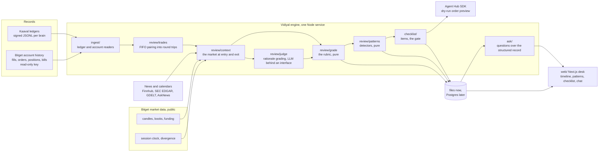
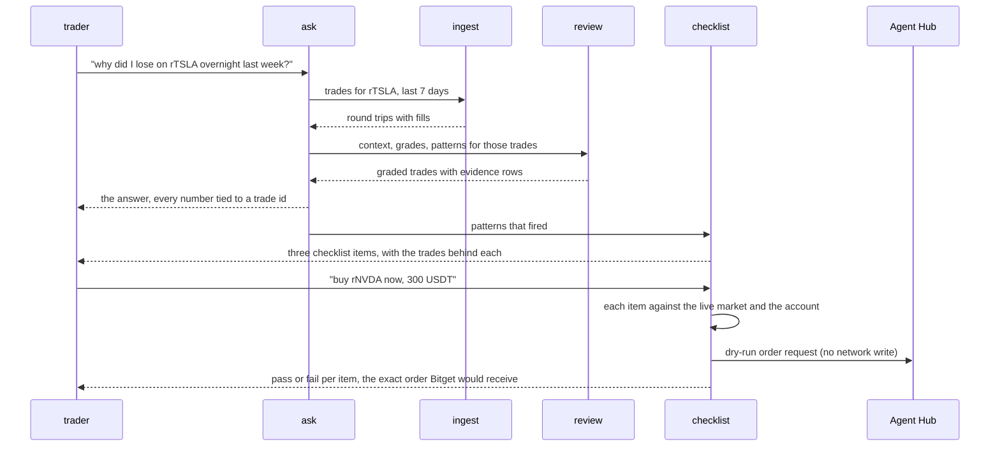
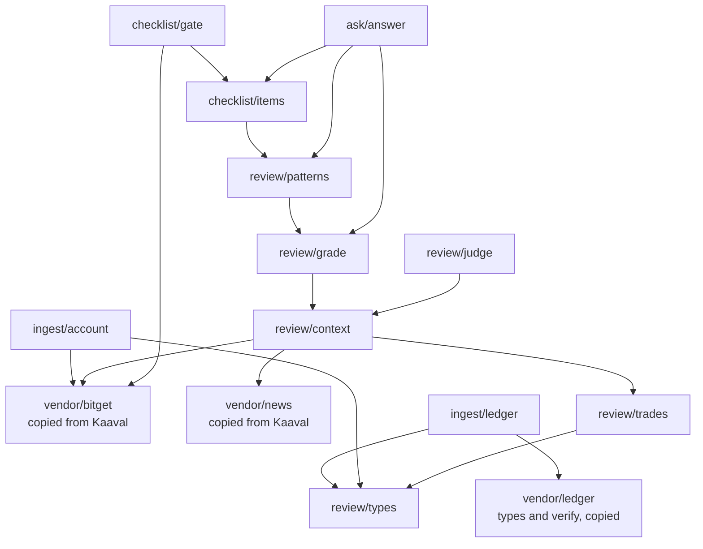
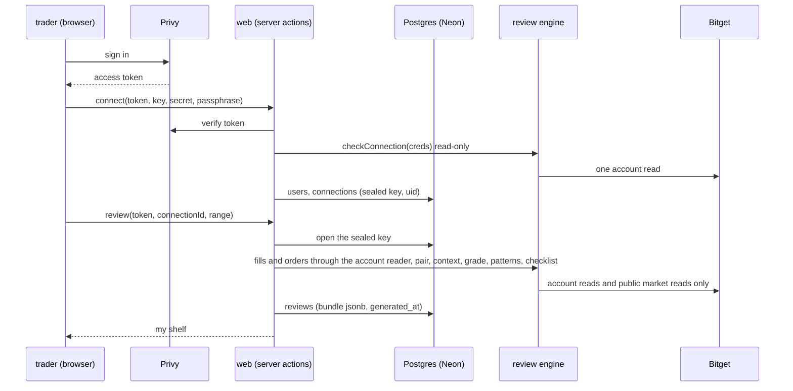

# Vidiyal architecture

Vidiyal is a review desk for people and agents who trade on Bitget. It reads a real record of
trades, rebuilds the market around each one, grades the decision against a fixed rubric, finds
the patterns that repeat, writes them into a checklist, and then holds every new idea against
that checklist before an order is even previewed. It never places an order on its own.

## What runs where

## One research task, end to end

The hackathon asks for one complete task from question to actionable insight. This is it.

## Modules and what depends on what

Rules of the graph: `grade/` and `patterns/` are pure functions over the trade table and its
context, with no network and no model, so two runs over the same record give the same grades.
`judge/` is the only place a model reads a trader's own words, and it sits behind an interface
so tests use a fake. Vendored code is copied, never imported across repos, so this repo runs on
its own from its README; the copies name their source commit in a header comment.

## Sources of record

| Source | How it is read | What it yields |
|---|---|---|
| Kaaval ledgers | `vendor/ledger` verifies the chain and signature first, then decisions, orders, fills, snapshots and marks are read per brain | Every fill with the book it hit, the decision that caused it, the rulebook checks it passed, and the brain's own rationale |
| A Bitget account | Agent Hub `order` verb fills and order history, `position` verb, `account_overview` bills, `tax` records, all read-only | Real fills with fees, plus balances over time |

Both become the same trade table, so a person and an agent are graded by the same rubric.

## Reviewing a trader's own account

A trader signs in, pastes a read-only Bitget key, and gets their own shelf: fills and
orders from the last 90 days through Agent Hub's read verbs, paired, graded, mined for
patterns, turned into a checklist, with the gate and the ask page working on their record.

The same rules as Kaaval's layer (the code is vendored from there): read-only enforced by
our SDK configuration, keys sealed under a server key from the environment, Privy's DID as
the user id, tables `users`, `connections`, `reviews` (id, connection_id, range_from,
range_to, bundle jsonb, verification jsonb, generated_at) and `audit`. A review of a
connected account is labelled "read-only account"; the demo review of Kaaval's ledger is
labelled "simulated record".

## What the web app reads

The desk is read-mostly. Every grade, pattern and checklist item on a screen comes from a
review bundle the engine produced from a real record; the only writes are a question typed
into the chat and an idea typed into the gate, and neither places an order. Until the Postgres
mirror exists the app reads bundle files on the machine that runs the engine through one
module, `web/lib/desk.ts`, which gets a Postgres backend later without the screens changing.

| Screen | Reads | Source |
|---|---|---|
| The shelf (hero) | Every graded round trip in the bundle as one spine: symbol, side, letter, total score, entry date, gross P&L, cost drag, the pattern tags that name it | `bundle.graded[]` from `data/state/reviews/<source>/<range>.json`, written by `npm run review -- --source ... --from ... --to ...` (a command this order adds to the engine's scripts) |
| Trade detail | The five scores with their evidence lines, the fills, the context (divergence at entry and exit, session, spread, book share, stop), the news titles near entry, the judge's reason | `bundle.graded[i]` |
| Patterns | Each pattern that fired, its description, the trades behind it and their evidence lines | `bundle.patterns[]` |
| Checklist | The items, each with its test text and the pattern it came from | `bundle.checklist[]` |
| Idea gate | The per-item pass or fail with the observed value, the verdict, the Agent Hub dry-run request or the note that none was built | `checkIdea()` run server-side on submit, reading live Bitget data through the vendored data layer |
| Ask | The narrative, the evidence table, the cited refs, the uncited-numbers list (shown when non-empty as the honesty check firing) | `answerQuestion()` run server-side on submit against the loaded bundle |
| Sources | Which record this review reads (Kaaval brain and ledger public key, or a Bitget account id), the range, the ledger verification result | `bundle.source`, `bundle.range`, and `verifyLedger` output stored with the bundle |

Labels: a review of a Kaaval brain says simulated record; a review of a Bitget account says
read-only. Every grade shows the numbers that produced it; a grade with no evidence line is a
bug, not a design.
