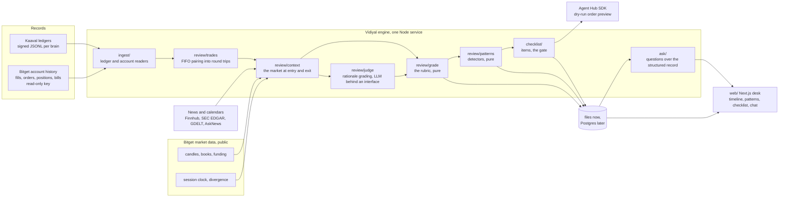
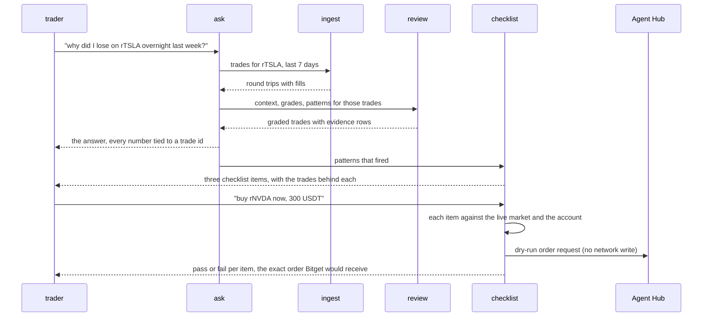
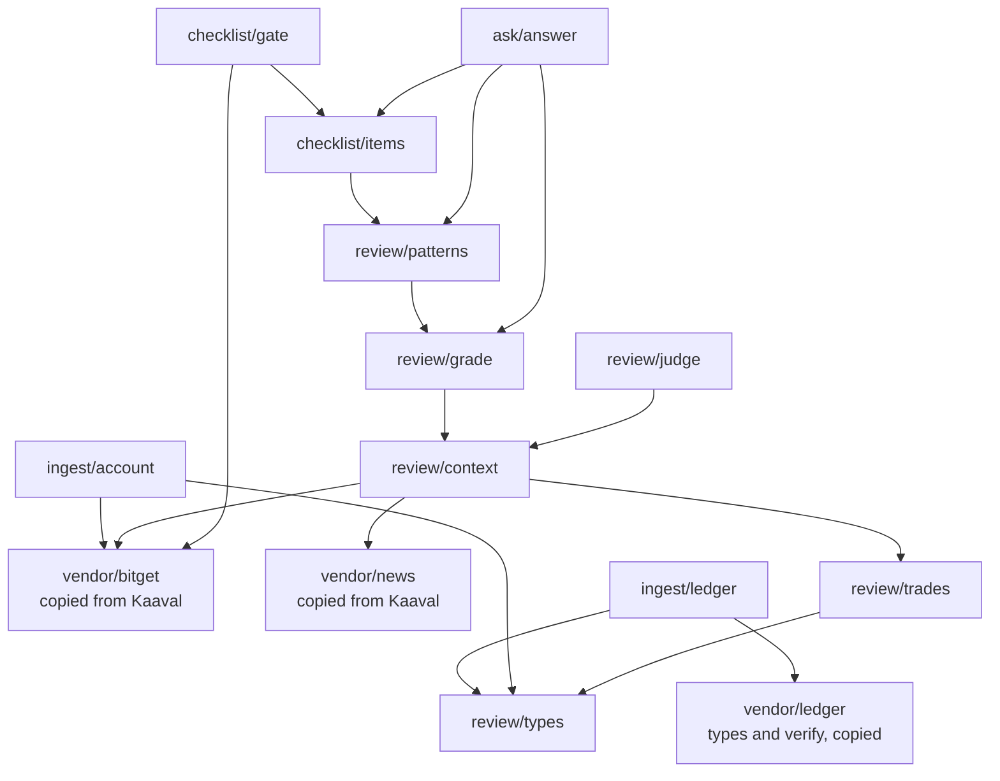

# Vidiyal

Vidiyal is Tamil for dawn, the morning after the trade.

Vidiyal is a review desk for Bitget. It reads a signed record of what an agent or a person
actually traded, rebuilds the market around every entry, grades the decision on five process
scores with the number behind each, finds the habits that repeat, and turns them into a
checklist the next order has to pass before Bitget would even see it.

[Live site](https://vidiyal-agent.vercel.app) &middot; [Documentation](https://vidiyal-agent.vercel.app/docs)
&middot; [Bitget program](https://bitget-ai.gitbook.io/bitgetai_hackathons2) &middot;
[Bitget Agent Hub](https://github.com/Bitget-AI/agent_hub) &middot; Kaaval, the sister trading
agent: [site](https://kaaval-agent.vercel.app), [repo](https://github.com/ramakrishnanhulk20/kaaval)

The record in the demo bundle below is simulated. It is the signed ledger of Kaaval's Claude
brain, a paper-trading agent that runs against live Bitget market data, so the prices, books and
news are real and the fills are not. Point the same command at a Bitget account with a read-only
key and every screen in this README works the same way.

## What it reviews

| Source of record | How it is read | What the review gets from it |
|---|---|---|
| A Kaaval ledger | `src/vendor/ledger` verifies the hash chain and the Ed25519 signature against a 64 character public key before one fill is read. A broken chain stops the review, it does not warn | Every fill with the order book it hit, the decision that caused it, the rulebook checks it passed, and the agent's own written rationale |
| A Bitget account | Agent Hub read verbs only, with a read-only key: `order` fills, `account_overview`, `funds_records`. No write verb is reachable from `src/ingest/account.ts` | Real fills with fees, and an equity curve walked back from the balance the account reports now |

Both become the same trade table, so a person and an agent are graded by the same rubric.

What the bundle on the desk holds today, read from `data/state/reviews/kaaval-claude.json`:

| Field | Value |
|---|---|
| Source | Kaaval ledger, brain `claude`, a simulated record |
| Range | 2026-09-11T08:21:29Z to 2026-09-11T08:25:51Z |
| Round trips graded | 5, in RNVDAUSDT, RVOOUSDT, RMUUSDT and RQQQUSDT: four B, one C |
| Patterns fired | 1, `fee-bleed`, proved by 5 trades |
| Detectors run | 9 |
| Checklist items | 1, `cost-under-20-bps` |
| Ledger verification | verified: 5 fills, 20 decisions, 20 equity marks |
| Public key | 64 hex characters, public half only, read from `kaaval/data/secrets/ledger-key.pub.hex` |
| Generated at | 2026-09-12T07:39:31Z |

## Overview

Bitget lists tokenized stocks that trade around the clock, and Agent Hub lets a bot trade them
while everyone is asleep. So the trades that decide a month happen at 3 a.m., and nobody looks at
them again. Trade journals exist for stocks, but a journal takes what you type into it, none of
them reads a Bitget account or an agent's ledger, and none of them has to show the evidence
behind a claim.

Vidiyal starts from the record instead of from memory. It pairs fills into round trips, pulls the
Bitget candles, book and funding around each entry, pulls the real news and the scheduled events
in the same window, grades the trade on five scores that are pure functions of those numbers, and
prints the number behind every score. The patterns that repeat across trades become checklist
items, and the checklist runs against the live market before the next order is previewed. Nothing
in Vidiyal places an order.

| A trade journal | Vidiyal |
|---|---|
| You type in what you remember about the trade | It reads a signed ledger, or a Bitget account through a read-only key. Nothing is typed in |
| One mood or confidence score out of ten | Five process scores out of five, each carrying the number that produced it |
| A coach's opinion, after the fact | A checklist that holds the next order against the live market, and ends at an Agent Hub dry run |
| An AI summary you have no way to check | An answer whose every number is matched against the evidence table, and thrown away when one of them is invented |

## Features

For the trader:

- The home page is one night of trading read back in daylight. The shelf stands every round trip
  on its spine, coloured by grade, with a sources panel underneath saying which record this is and
  whether it verified, and the scroll below it walks one trade from the entry to the rule it became.
- A grade is five numbers, not a letter: entry context, sizing, exit discipline, cost drag and
  reasoning, each with the evidence line that produced it, such as
  `cost: 0.2262 USDT of friction against a gross of 0.0491 USDT, so friction was the whole trade`.
- Patterns are detectors over the whole table. Each card names the trades that prove it, and the
  detectors that ran and found nothing are listed too, so silence is visible.
- The checklist is what those patterns became: one item per pattern, each with a test that can be
  run against the live market.
- The gate holds a new idea against those items using live Bitget data, and a pass ends at the
  Agent Hub dry run: the exact request Bitget would receive, never sent.

Review your own account. Set a read-only Bitget key in `.env` and run `npx tsx scripts/review-account.ts`:
the engine reads your own fills for the last 30 days through Agent Hub's `order` fills verb,
paging with the cursor until Bitget runs out of rows, and builds the same bundle the demo
review builds. Nothing is ever written: the surface the key goes into is read-only by
construction, the only verbs used on it are `order` fills, `account_overview` and
`funds_records`, and a test drives the whole review through a stand-in Bitget and asserts that
not one write call was made. Bitget keeps 90 days of fills, so a longer range is clipped to 90
days and the review says so. With no key set the same command runs against a fixture account,
so the shape can be seen on a machine that has never held one.

For your account, on the site:

- Sign in at `/connect` with email, Google, X or a passkey, paste a read-only Bitget key, and the
  desk checks it with one read and shows you what it saw: the account number, the equity and the
  open positions. A key Bitget refuses is never stored, and the reason comes back as a sentence
  with the next step in it.
- The key is sealed with AES-256-GCM under a server key before it is written, and no screen, no
  list and no error message ever hands any part of it back.
- `/account` lists your keys and every review read through them. One button reads your last 90
  days: fills paired into round trips, the market rebuilt around each one, the rubric, the
  detectors, the checklist. It takes about a minute, and asking twice inside ten minutes gives
  back the same review rather than reading Bitget again. Six reviews an hour per trader.
- `/account/reviews/<id>` is your own shelf: the same spines, the same trade pages, the same
  patterns and checklist, and the gate and the ask working on your record instead of the demo
  one. Remove a key and every review read with it goes too.

For a judge:

- The rubric is written down in `docs/rubric.md`, and the weights and thresholds in
  `src/review/grade.ts` are the same numbers.
- The honesty check: every number in a written answer is matched against the evidence table, and
  an answer carrying a number no trade backs is discarded in favour of the paragraph the table
  writes for itself. The desk says so on screen when that happens.
- The ledger check runs before the review, not after, and its result travels with the bundle.
- One command, `npm run proof:review`, runs the whole pipeline end to end against live Bitget data
  and prints every number it used.

For a developer:

- `src/vendor/bitget` is the data layer: one `invoke` that turns a failed Agent Hub call into a
  thrown `BitgetError` instead of an undefined that becomes NaN three layers later.
- `ReviewBundle` is the one shape the desk reads: `source`, `range`, `graded[]`, `patterns[]`,
  `checklist[]`, `equityCurve[]`. Write one and every screen works.
- `NewsProvider` and `RationaleJudge` are one-method interfaces, so a test runs the whole review
  with no network and no model.

## How it uses Bitget

Every call goes through the Agent Hub SDK (`@bitget-ai/bitget-agent-sdk` 3.3.0), built read-only
by `createBitget()` in `src/vendor/bitget/client.ts`. The one exception is the dry run, which is
built in its own function so the read-only context can never be the one holding a write verb.

| Agent Hub call | What Vidiyal does with it | Where |
|---|---|---|
| `market` / `candlesHistory` | The price at the last regular close before an entry, the divergence at entry and exit, and whether a stop was crossed while the position was open | `src/vendor/bitget/market.ts:206`, called from `src/review/context.ts:152` and `:224` |
| `market` / `tickers` | The live price the gate sizes an idea against | `market.ts:97`, called from `src/checklist/gate.ts:57` |
| `market` / `orderbook` | Book depth for the cost estimate behind the 20 basis point item | `market.ts:128`, called from `src/vendor/bitget/cost.ts:68` |
| `market` / `instruments` | Quantity precision and base coin, so a previewed order is sized the way Bitget wants it | `market.ts:257` and `:270`, called from `gate.ts:239` |
| `market` / `fundingRate` | Funding cost per day for a perpetual idea | `market.ts:306`, called from `cost.ts:135` |
| `market` / `fundingRateHistory` | The funding a perpetual position actually paid while it was open, charged into cost drag | `market.ts:328`, called from `src/review/context.ts:127` |
| `order` / `fills` | Real fills for an account review, 30 days per call, both product lines | `src/ingest/account.ts:35` |
| `account_overview` | Total equity now, the anchor the equity curve is walked back from | `src/ingest/account.ts:54` |
| `funds_records` / `financial` | Balance changes, so sizing can be graded against equity at the time | `src/ingest/account.ts:65` |
| `order` / `place` with `dryRun: true` | The exact request Bitget would receive when an idea passes every checklist item. It is never sent | `src/checklist/gate.ts`, `previewOrder` |

Market reads need no key and no account. Only the three account reads do, and they are read-only.

## How it fits together

What runs where:



One research task, end to end:



Modules and what depends on what:



## The two-minute judge path

```bash
npm install
npm test
```

```
 Test Files  11 passed | 2 skipped (13)
      Tests  118 passed | 3 skipped (121)
```

The two skipped files are the live ones. `LIVE=1 npm test` adds them and hits the public Bitget
and news endpoints for real.

Next, the review that wrote the bundle on the desk. It needs the Kaaval checkout sitting beside
this one, because a signed ledger and its public key are not in this repo:

```bash
npm run review -- --source kaaval --brain claude \
  --ledger ../kaaval/data/state/ledger \
  --pubkey ../kaaval/data/secrets/ledger-key.pub.hex \
  --out kaaval-claude
```

It prints the ledger verification first, then one line per graded trade, and writes
`data/state/reviews/kaaval-claude.json`. The flags: `--source` (only `kaaval` today), `--brain`,
`--ledger`, `--pubkey`, `--from` and `--to` as ISO dates, and `--out` for the bundle name.

Then the whole pipeline, end to end, against live Bitget data:

```bash
npm run proof:review
```

The last lines of the run on 2026-09-12:

```
Idea: buy RTSLAUSDT 300 USDT
  pass  No entries while the price is more than 1 percent from the last regular close
        RTSLAUSDT is -0.34 percent from the 2026-09-11T19:45:00.000Z anchor candle close of 365.44
  pass  The round trip costs less than 20 basis points, a fifth of a one percent move
        1.0 bps to get in and hold a day: 1.0 impact, 0.0 fee, no funding; Bitget publishes no taker fee rate for RTSLAUSDT, fees are not in the total
  verdict: passes the checklist
  Agent Hub previewed the order without sending it: 300.00 USDT of quote, which is how Bitget sizes a SPOT market buy
  {"dryRun":true,"operationId":"placeOrder","method":"POST","path":"/api/v3/trade/place-order","riskLevel":"write","wouldSend":{"category":"SPOT","symbol":"RTSLAUSDT","side":"buy","orderType":"market","qty":"300.00","clientOid":"c3dff94f-418f-493e-b96f-e30b2b268563"}}

review bundle: 2 graded trades, 2 patterns, 2 checklist items, 1 equity points

Question: why did this account lose on rTSLA?
  answered by: claude-haiku-4-5-20251001, checked against the evidence below
  ... the written answer and its 28 row evidence table, cut here ...
  cited refs: ledger-demo:4>ledger-demo:6, ledger-demo:4>open
  numbers with no evidence behind them: none, every number in the answer came from a trade

account review skipped: no BITGET_API_KEY
```

Then the desk, at `http://localhost:3001`, in this order:

1. `/` the home page, one night read back in daylight. It opens on the shelf, every round trip
   as a spine coloured by grade, then the sources panel: which record, the range, the public key,
   the ledger check, when the bundle was written. Scroll on and the same bundle tells the story:
   the 3 a.m. trade nobody reviewed, its five scores walked one at a time, the habit it repeated
   and the checklist item that habit became, held against the live market, then the record check
   and the invitation to hand over your own.
2. `/trades/<round trip id>` one trade. The letter, then the five scores with the evidence line
   behind each, the signed fills, the market rebuilt around the entry, the headlines the feed
   found in that window, and the judge's own sentence.
3. `/patterns`. One card per detector that fired, with the trades that prove it, and the names of
   the nine detectors that ran.
4. `/checklist`. The item each pattern became, with the test the gate runs.
5. `/gate`. Pick an instrument, side buy, 300 USDT, and hold it. Every item is tested against the
   live market, and a pass ends at the Agent Hub dry run request. The instrument list is the four
   this review traded plus the universe the engine last built, because a symbol the desk offers
   that the engine does not trade is a promise the record cannot keep.
6. `/ask`. Type "why did this account lose on rMU?". The answer comes back over the evidence table
   it was allowed to use. When the model writes a number no row holds, the page says the draft was
   thrown away, lists the invented numbers, and shows the paragraph the table wrote instead.
7. `/docs`. The documentation, inside the app: getting started, the concepts, one guide per screen,
   the developer pages with the three architecture diagrams, the API reference, the security pages
   and the FAQ. Search is on the page.

The longer version, with what each screen proves, is in [docs/judge-path.md](docs/judge-path.md).

## Quick start

```bash
npm install
cp .env.example .env      # nothing needs filling in for a ledger review
npm run typecheck
npm test
npm run proof:review
npm run discover          # refreshes docs/dev/account-schemas.md from the SDK
```

Every key in `.env` is optional and nothing in this repo logs one:

| Key | What it is for | Without it |
|---|---|---|
| `BITGET_API_KEY`, `BITGET_SECRET_KEY`, `BITGET_PASSPHRASE` | A read-only account review | The proof prints `account review skipped: no BITGET_API_KEY` and reviews the ledger only; a key Bitget refuses prints `account review skipped: Bitget refused the key` with Bitget's reason, and the ledger review above it still stands |
| `BITGET_ACCOUNT_ID` | A label for the account being reviewed, which Bitget never sees | The record is tagged `account` |
| `KAAVAL_LEDGER_DIR`, `KAAVAL_LEDGER_PUBLIC_KEY_HEX`, `KAAVAL_BRAIN` | Which ledger, which public key, which brain | The Kaaval checkout beside this repo, brain `claude` |
| `QWEN_API_KEY`, or `ANTHROPIC_API_KEY` when there is no Qwen key | The reasoning score and the written answer: Qwen first, Claude as the fallback | A trade with a note is left ungraded rather than guessed at, and the evidence table writes the answer itself |
| `FINNHUB_API_KEY` | Company news and the earnings and macro calendars | The feed still reads SEC EDGAR and GDELT, which need no key |
| `ASKNEWS_API_KEY` | A news search across many outlets for trades inside the last 48 hours | The source is skipped |
| `ASKNEWS_HISTORICAL` | Set to 1 to search the AskNews archive for older trades too, one credit per traded hour | Older trades are reviewed from the other sources |
| `KAAVAL_USER_AGENT` | The contact address SEC asks every caller to send | EDGAR refuses the request |
| `KAAVAL_HTTP_TIMEOUT_MS`, `KAAVAL_BITGET_TIMEOUT_MS` | Per request timeouts | 20000 and 15000 milliseconds |
| `NEXT_PUBLIC_PRIVY_APP_ID`, `PRIVY_APP_SECRET` | Sign-in for the account area | `/connect` and `/account` say plainly that sign-in is not set up on this host |
| `DATABASE_URL` | The Postgres that holds traders, their sealed keys and their reviews | The account screens refuse to store anything and say which setting is missing |
| `KAAVAL_KEY_SEAL_HEX` | The 32 bytes a trader's Bitget key is sealed under. Kaaval and Vidiyal share one database and one seal key, so the name stays as it is | No key can be stored, and the screens say so |

The account area needs its database brought up to shape once, which is one command and is safe to
run again at any time:

```bash
cd web && npx tsx scripts/migrate.mts   # with DATABASE_URL unset it migrates an embedded Postgres and keeps nothing
```

The desk is a Next.js app in `web/`. It reads the bundles the engine wrote and never calls a
third-party API from the browser:

```bash
cd web && npm install && npm run dev   # http://localhost:3001
```

On this machine pm2 keeps it up as `vidiyal-web`. Three variables steer it: `VIDIYAL_DATA_DIR`
points at another state folder (default `../data/state`), `VIDIYAL_REVIEW` picks which bundle the
shelf reads (default `kaaval-claude`), and `VIDIYAL_ENGINE_DIR` names the engine folder the desk
runs the gate and the ask scripts from (default the parent of `web/`). Those two scripts run in
their own process, so the Bitget and Anthropic keys stay in the engine's `.env` and never reach
the server that renders pages.

## Keeping reviews fresh

Kaaval's ledger grows every fifteen minutes, so a review written once is stale by the afternoon.
`scripts/review-loop.ts` rebuilds every bundle on a timer: it finds each brain that decided
something in the ledger, grades that brain's round trips, and writes `data/state/reviews/<name>.json`
plus a `manifest.json` naming what it wrote, when, and how many round trips each one holds. Two
cycles over both brains, measured on 12 September 2026, took 240 and 238 seconds; almost all of
that is the news feed waiting on GDELT, which rate limits every caller.
`VIDIYAL_REVIEW_MINUTES` sets the gap between cycles, default 60.

```bash
npx tsx scripts/review.ts --help          # the flags, including --all
npx tsx scripts/review-loop.ts --once     # one rebuild of every brain, then stop
pm2 start ecosystem.config.cjs --only vidiyal-review && pm2 save
```

pm2 keeps it running as `vidiyal-review` and brings it back after a reboot. A cycle that throws is
logged and the loop carries on, because the bundles already on the shelf are still true and each
one says when it was generated. A cycle that goes ten minutes without finishing is treated as hung:
the loop exits with code 2 and pm2 starts a clean one, since a stuck network read inside the
process cannot be cancelled from the outside.

### Running the desk on Vercel

The desk can read its bundles over HTTP instead of off a disk. Set `VIDIYAL_RECORD_URL` to the base
URL the record is published under and every screen reads `<url>/vidiyal/reviews/<name>.json`, with
`<url>/vidiyal/manifest.json` naming what is published. Each read is cached for sixty seconds. The
publisher copies the loop's output into a public repository every fifteen minutes, so the hosted
desk shows the same numbers as the machine watching the ledger, a few minutes behind.

There is no engine folder on a host like that, so the gate and the ask cannot start a child
process. `VIDIYAL_ENGINE_MODE=import` makes the desk call `checkIdea` and `answerQuestion` in its
own process instead, with the same arguments and the same answers; the mode defaults to `spawn`
when the engine's `node_modules` is beside the app and `import` when it is not. Import mode reads
`QWEN_API_KEY`, then `ANTHROPIC_API_KEY`, from the host's environment, and with neither the evidence
table writes the answer itself. The app builds with webpack rather than Turbopack for one reason: the engine names
the `.js` each of its TypeScript files compiles to, and only webpack can be told to read those as
the `.ts` they are.

## The rubric

Five scores from 0 to 5 and a letter, from `src/review/grade.ts`. The first four are pure
functions of the trade and the market around it. The fifth is the only one a model touches. The
full text, with what each score measures, is in [docs/rubric.md](docs/rubric.md).

| Score | Weight | Full marks at | Zero at |
|---|---|---|---|
| Entry context | 25 | Within 0.5 percent of the last regular close, spread at its usual level | 2 percent from the close, spread 3 times usual, or an entry inside the 09:25 to 09:40 ET re-anchoring window |
| Sizing | 20 | At or under the cap: the rulebook percentage for an agent, the median size for a person, and a quarter of the visible book | Twice the cap |
| Exit discipline | 25 | Stop honoured, loser held no longer than the winners' median, nothing added under water | Stop crossed and left open, loser held twice the winners' median, or a high divergence weekend entry carried into the open |
| Cost drag | 15 | Friction under 10 percent of gross | Friction over 50 percent of gross, or a gross smaller than its costs |
| Reasoning | 15 | The thesis names a cause that was observable at entry and the exit matched its horizon | The outcome is claimed as skill when the thesis was wrong. No note scores 2, never 0 |

Letters: A at 85, B at 70, C at 55, D at 40, E below. A component with nothing in the record to
measure scores a neutral 2.5 rather than costing points. A scheduled event within 60 minutes of an
entry is only forgiven when a rationale was written.

The nine detectors, from `src/review/patterns.ts`, all of which ran on the demo bundle:

| Detector | Fires when |
|---|---|
| `revenge-trading` | A new entry in the same instrument within 30 minutes of a losing exit, at a larger size |
| `weekend-overexposure` | Net exposure into a weekend above 40 percent of equity, or an unhedged rToken above 10 percent |
| `chasing-the-gap` | More than one entry while divergence was over 1 percent |
| `overtrading` | Turnover above 5 times equity in a week with cost drag above 30 percent of gross |
| `holding-losers` | Median holding time of losers above twice that of winners |
| `concentration` | One instrument above half of total exposure for more than a day |
| `fee-bleed` | Fees plus slippage plus funding above 20 percent of gross over the period |
| `ignored-stops` | A position that crossed its stop and stayed open for more than one tick |
| `added-while-under-water` | A fill that added to a position while it was under water |

## Tests

```
 Test Files  11 passed | 2 skipped (13)
      Tests  118 passed | 3 skipped (121)
```

`npm test` on 2026-09-12, 1.16 seconds. The eleven files cover the trade pairing, the context
builder, the rubric, the judge, the detectors, the gate, the answer and its honesty check, the
HTTP cache, the desk calling the engine in the same process, and the instrument list read out of
the published record, all against recorded Bitget responses. The two skipped files are the live ones, behind
`LIVE=1`, which hit the public Bitget API and the news hosts for real.

What the suite does not cover: an account review against a real Bitget key, which needs
credentials the suite does not carry, and the web pages, which have no tests of their own yet.

## What a review costs

Counted from the code paths, not metered against a bill.

- News, per company per hour of trading: at most one SEC EDGAR call, one GDELT query and two
  Finnhub calls, the company news and the earnings calendar. The macro calendar is one more
  Finnhub call per day of the range. Every gather is bucketed to the hour and cached to
  `data/state/news-cache`, so a second review of the same record costs nothing.
- Bitget, per round trip: two public candle reads for an open trip, three for a closed one, plus
  one funding history read on a perpetual. Public endpoints, no key, no cost.
- The model: one call per round trip that carries a written note, and one call per question on the
  ask page. Nothing else in a review touches a model, so a record with no notes and no questions
  costs no model calls at all.

## Project structure

```
src/
  ingest/      ledger and Bitget account readers, one trade table out of both
  review/      trades (FIFO pairing), context, grade, judge, patterns, news
  checklist/   items from patterns, and the gate that tests an idea
  ask/         retrieval, the evidence table, the honesty check
  vendor/      bitget, news, ledger and llm, copied from Kaaval with the source commit in a header
scripts/       review, review-loop, proof-review, discover
test/          unit tests and recorded fixtures, plus the two LIVE=1 files
web/           the Next.js desk: app routes, components, lib, engine scripts
docs/          the rubric and the judge path
data/state/    review bundles and the news cache, git ignored
```

## Tech stack

| Piece | Version |
|---|---|
| `@bitget-ai/bitget-agent-sdk` | 3.3.0 |
| `@anthropic-ai/sdk` | 0.124.0 |
| `dotenv` | 17.4.2 |
| TypeScript (engine) | 7.0.2 |
| Vitest | 5.0.0 |
| tsx | 4.23.13 |
| Next.js | 16.3.5 |
| React and React DOM | 19.2.8 |
| Framer Motion | 13.2.0 |
| Lenis | 1.3.26 |
| `fumadocs-core` | 16.15.10 |
| `fumadocs-mdx` | 15.4.0 |
| Mermaid | 11.17.2 |
| Tailwind CSS and `@tailwindcss/postcss` | 4.3.3 |
| TypeScript (web) | 5.9.3 |
| Node | 26.7.0 on this machine |

Every version is pinned exactly in `package.json` and `web/package.json`, and locked in
`package-lock.json`.

## Security

- Bitget credentials are read-only and are never passed as arguments: the SDK picks them out of
  the environment, and `createBitget()` builds the tool surface read-only by default.
- The web process never holds a key. The gate and the ask page run the engine in a separate
  process through `web/scripts/engine-*.mts`, and the keys stay in the engine's `.env`.
- The one write verb Vidiyal touches is `order` / `place` with `dryRun: true`, built in its own
  function against its own config, and the SDK answers with the request rather than sending it.
- A ledger is verified before it is read, and every number in a written answer is checked against
  the evidence table before anyone sees it.
- Not covered: the Kaaval ledger's own key handling, which lives in that repo; rate limiting on
  the desk, which is a single-user app today; and custody of funds, because Vidiyal never holds or
  moves any.

## Licence

MIT. See [LICENSE](LICENSE).

## Acknowledgments

- [Bitget Agent Hub](https://github.com/Bitget-AI/agent_hub) for the SDK every read and the dry
  run go through.
- Bitget public market data: candles, order books, instruments and funding, the tape this review
  is rebuilt from.
- Alibaba Qwen through Bitget's hackathon endpoint, the desk's first choice for the reasoning judge
  and the answers, with Claude behind the same `LlmClient` interface as the fallback.
- SEC EDGAR for 8-K filings, GDELT for headlines, and Finnhub for company news and the earnings
  and macro calendars.
- Kaaval, the sister trading agent, whose signed ledger is the record this desk reviews and whose
  Bitget, news and ledger modules are vendored here.
