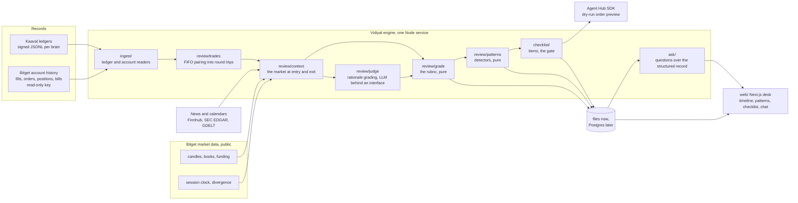
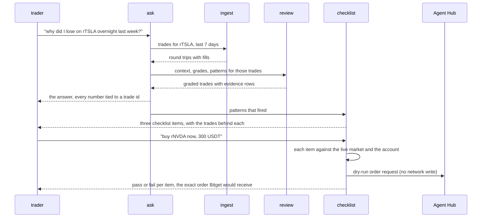
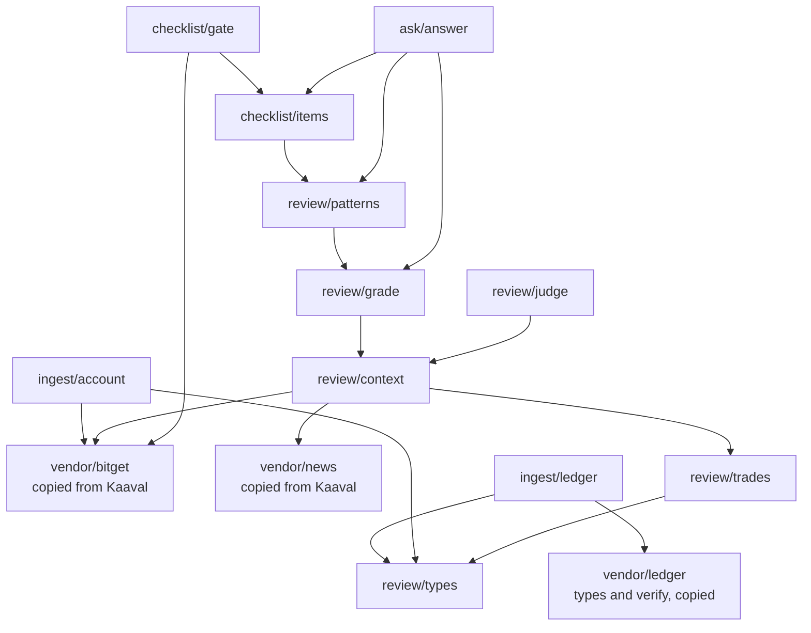

Three diagrams, the same three that are in `ARCHITECTURE.md` and the README in the repo.

## What runs where

The engine is one Node service. Records come in on the left, Bitget market data and the news feed
give every trade its context, and everything a screen reads leaves through the store.

Rules of the graph: `grade/` and `patterns/` are pure functions over the trade table and its
context, with no network and no model, so two runs over the same record give the same grades.
`judge/` is the only place a model reads a trader's own words, and it sits behind an interface so
tests use a fake.

## One research task, end to end

From a question to a checklist item to an order that was never sent.

## Modules and what depends on what

Vendored code is copied, never imported across repos, so this repo runs on its own from its
README. The copies name their source commit in a header comment.

The direction of every arrow is a rule: nothing under `review/` reads the web app, and nothing in
the web app imports the engine. The desk runs the engine in a separate process instead, which is
what keeps the Bitget and model keys out of the process that renders pages.
